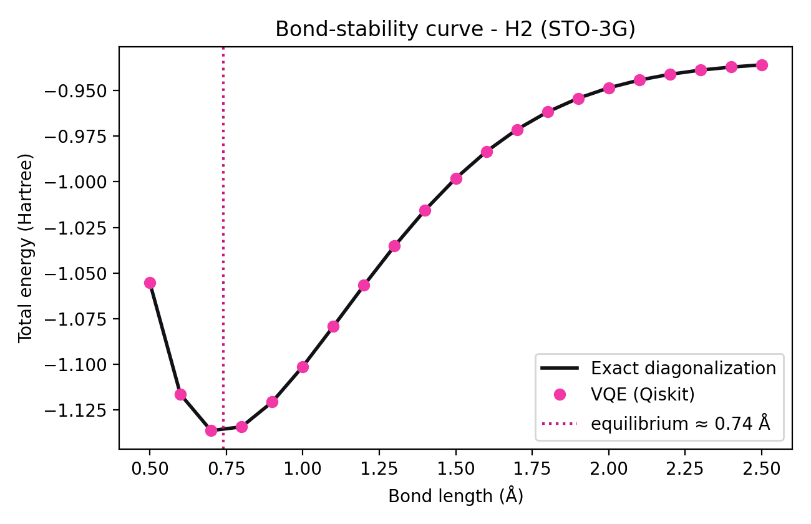
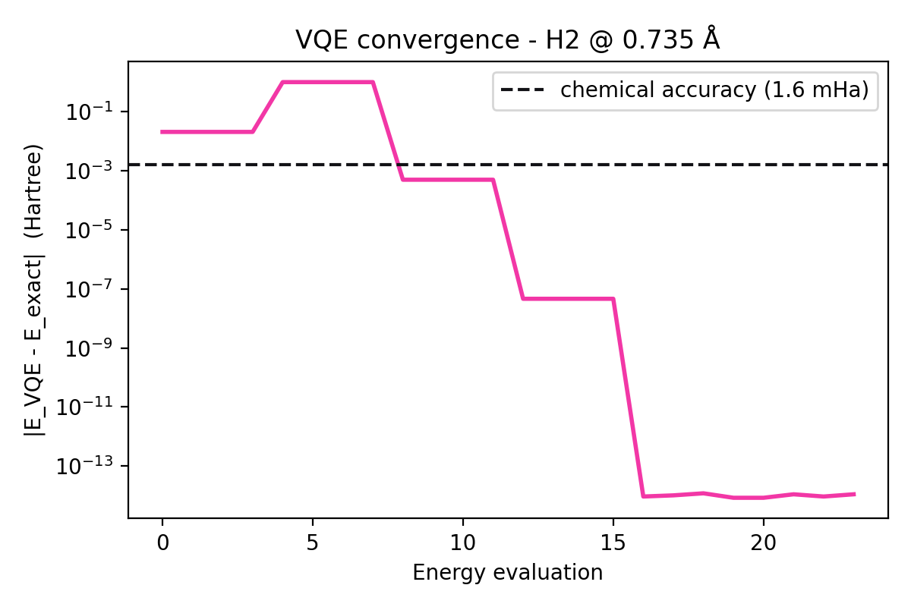

# QuMat-Shield — VQE prototype (Team QForge)

**Author:** Siva Prasad (solo participant) · Qiskit Hackathon, Round 1

Quantum simulation of small material fragments with Qiskit. The pipeline finds the
ground-state energy with VQE, checks it against exact diagonalization, and scans the
bond length to get a bond-stability curve.

**Pipeline:** fragment (PySCF) → qubit Hamiltonian (Jordan-Wigner) → VQE with UCCSD ansatz
(Qiskit Estimator, quantum step) → SciPy optimizer (classical step) → ground-state energy
→ exact benchmark → bond length / stability.

## Results (measured, H2 / STO-3G, exact statevector simulator)

| Quantity | Value |
|---|---|
| E_VQE (0.735 Å) | -1.1373060 Ha |
| E_exact | -1.1373060 Ha |
| Hartree-Fock energy | -1.1169990 Ha |
| Absolute error | ~1e-14 Ha (chemical accuracy = 1.6e-3 Ha) |
| Qubits / parameters | 4 / 3 |
| Optimizer iterations / energy evaluations | 4 / 24 (L-BFGS-B) |
| Equilibrium bond length (21-point scan) | ~0.74 Å |

VQE matches exact diagonalization at all 21 bond lengths (0.5–2.5 Å), with error ~1e-14 Ha.




Data: `h2_scan.csv`, `h2_single.json`, `h2_insight.json`.

## Run (Google Colab or Linux/WSL)
```
pip install -r requirements.txt
python qumat_shield_vqe.py --molecule h2  --mode single   # validation
python qumat_shield_vqe.py --molecule h2  --mode scan     # bond-stability curve
python qumat_shield_vqe.py --molecule lih --mode scan     # metal-hydride fragment (not yet reported)
```
Results are written to `./results`.

## Limits (please read)
- Ideal, noise-free simulation of a tiny system. Errors on real hardware will be much larger
  and need error mitigation.
- STO-3G is a minimal basis, so absolute bond energies are not experimental-grade.
- H2 and LiH are proof-of-concept fragments, not real stealth alloys. Dipole moment,
  energy gap and noisy-hardware runs are planned next steps.
